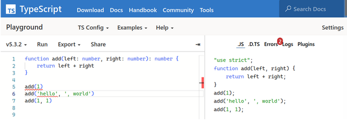
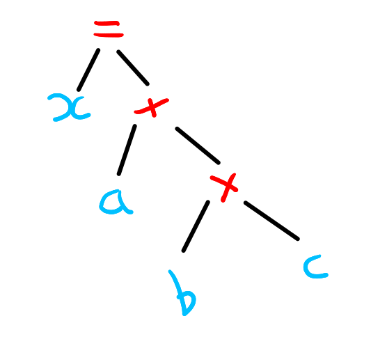
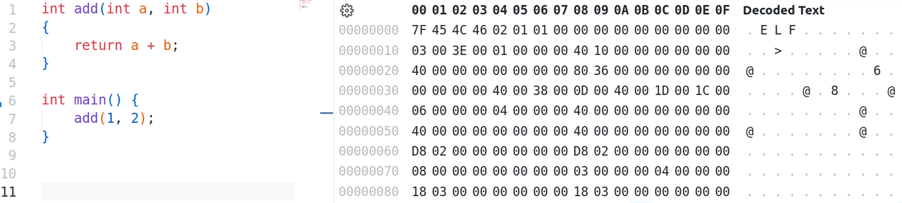

# Créer un langage de programmation - Introduction
##### Édition TypeScript

## Sommaire

- [Pourquoi apprendre à créer un langage de programmation ?](#pourquoi-apprendre-à-créer-un-langage-de-programmation-)
- [Pourquoi utiliser TypeScript ?](#pourquoi-utiliser-typescript-)
- [Langages de programmation compilés vs interprétés](#langages-de-programmation-compilés-vs-interprétés)
- [Interpréteur d'AST](#interpréteur-dast)
- [Machines Virtuelles et Byte Codes](#machines-virtuelles-et-byte-codes)
- [Étapes de compilation](#étapes-de-compilation)


## Pourquoi apprendre à créer un langage de programmation ?
C'est une question légitime, pourquoi investir du temps dans une tâche de cette complexité ? 

**Premier point**, je parle de complexité, car je suppose qu'une bonne partie des lecteurs imaginent cette complexité sur la base de leur expérience avec des langages polyvalents utilisés dans des millions de projets, mais, bonne nouvelle, créer un "langage jouet" est loin d'être autant complexe. C'est un peu comme faire des legos, on peut pousser la réflexion assez loin, mais en dernière instance, nous ne sommes pas tenus de respecter des impératifs de production.

**Deuxième point**, apprendre à créer un langage de programmation permet de mieux comprendre les outils qu'utilisent les développeurs au quotidien. Je pense évidemment à leur langage de programmation de prédilection, mais également divers outils et librairies (éditeurs de code, moteurs de templates, transpilateurs, linters...).

**Troisième point**, créer un langage de programmation permet d'implémenter des notions fondamentales en informatique théorique. Par exemple, nous verrons comment la théorie des automates s'applique au parsing.

**Quatrième point**, vous serez en mesure de créer votre propre langage. Il y a peu de chances que vous souhaitiez un jour créer un langage polyvalent de type C++, Rust, Python ou JavaScript, mais il se pourrait que vous souhaitiez développer un DSL (Domain Specific Language). SQL, un langage conçu spécifiquement pour interagir avec les systèmes de gestion de bases de données, est un exemple classique de DSL. Le composant [ExpressionLanguage](https://symfony.com/doc/current/components/expression_language.html) du projet **Symfony** est un autre exemple de DSL, qui offre un moyen flexible et puissant de configurer une application PHP.

En fonction de vos intérêts propres, je suis sûr que vous pouvez concevoir bien d'autres raisons de créer votre propre langage. Pour moi, je dirais tout simplement que c'est un projet passionnant et fun !

## Pourquoi utiliser TypeScript ?
TypeScript, c'est JavaScript avec des types. Bon, c'est un peu plus que ça, mais ce cours n'est pas un cours sur TypeScript...
Pour résumé, TypeScript est un langage compilé. Son compilateur procède à une analyse sémantique et compile le tout en JavaScript valide pour les navigateurs et autres environnements d'exécution de JavaScript. Utiliser TypeScript contribue à améliorer la maintenabilité, la lisibilité, et la prédictibilité des projets écrits en JavaScript.

Exemple d'analyse sémantique et compilation d'un code TypeScript en JavaScript :

|  |
|:--:| 
| https://www.typescriptlang.org/play |

### Pourquoi ce choix de langage ?

Tout simplement, car *je* lui trouve des avantages pédagogiques :
- Système de typage relativement avancé (génériques, unions, intersections…)
- Haut niveau, simple d’utilisation
- Appartient syntaxiquement à la famille des langages C (syntaxe populaire)
- Propose un paradigme orienté objet : classes, interfaces, visibilité… (la POO est très populaire et peut-être pratique pour générer un AST)

Mais, rassurez-vous, connaître TypeScript n'est absolument pas nécessaire pour suivre ce cours. Je vous conseille même d'utiliser votre langage de prédilection si cela vous permet d'être plus à l'aise.

## Langages de programmation compilés vs interprétés
Bon, avant de nous lancer dans des sujets plus pointus, il serait bon de définir quelques concepts.

### Langages interprétés
Un langage dit interprété est un langage dont le code source est pris en charge et exécuté par un logiciel appelé **moteur** ou **interpréteur** sans nécessiter de compilation préalable. Ce logiciel est souvent écrit dans un langage de plus bas niveau que le langage source, par exemple le moteur V8, chargé d'exécuter du JavaScript dans Chrome et Node.js, [est écrit en `C++`](https://v8.dev/#:~:text=What%20is%20V8%3F%20V8%20is,32%2C%20ARM%2C%20or%20MIPS%20processors).

### Langages compilés
Certains d'entre vous ont peut-être appris que la compilation consiste à transformer un code source en du code machine (compilation de C/C++, par exemple). Il est vrai que ce type de transformation est une compilation, mais le concept de compilation est plus général. La compilation décrit le processus de transformation d'un code source en un code cible.

Par exemple, dans ce cours, nous allons utiliser TypeScript, qui, comme nous l'avons vu, est un langage compilé en JavaScript, un autre code source. Ce type de compilateur est souvent appelé [**source-to-source compiler**](https://en.wikipedia.org/wiki/Source-to-source_compiler), **transcompiler** ou **transpiler** en référence au niveau d'abstraction similaire entre le code source et le code cible, mais l'utilisation de ces termes est parfois sujet à débat. Par ailleurs, beaucoup des documentations officielles de ces outils emploient le terme *compilateur* pour les définir. Ces détails sémantiques n'ont pas tellement d'importance, mais je préfère prévenir toute confusion en amont.

### Analogie avec les langages naturels
Afin d'être certains que ces deux concepts sont bien compris, je vous propose une analogie avec les langages naturels. 

Admettons que vous souhaitiez partager un article rédigé en anglais à un public francophone. Vous traduisez donc le texte et vous publiez l'article en français. Vous venez de transformer un langage source (anglais) en un langage cible (français), ce qui est similaire au processus de compilation.

Autre situation, vous êtes journaliste et vous apprêtez à traduire en direct le discours d'un homme politique chinois. Ne sachant pas à l'avance ce qui va être dit, vous allez donc devoir traduire et retranscrire le discours en direct. Cette situation est similaire au principe d'interprétation. Vous venez d'interpréter un langage source (chinois) et l'avez retranscrit en direct en français.

### Interpréteur d'AST
Un arbre de la syntaxe abstraite ou AST (Abstract Syntax Tree) en anglais, est une représentation arborescente de la structure syntaxique d'un code source. Chaque nœud représente une construction dans le langage (par exemple, une expression, une instruction, etc.).

Prenons l'exemple d'une déclaration de variable :
```javascript
var x = a + b * c
```

Voici une représentation possible sous forme d'AST :

|  |
|:--:|
| AST simplifié |

Un interpréteur d'AST est un programme qui va parcourir l'AST et exécuter chaque instruction qu'il contient. Un de ses avantages majeurs est que le code source ne nécessite aucune compilation, ce qui lui confère une excellente portabilité. De plus, un AST peut contenir beaucoup d'informations, permettant une analyse et une manipulation très fine du code source. Mais sa structure s'accompagne également d'inconvénients, analyser et exécuter chaque nœud de l'AST en temps réel n'est pas performant en termes de rapidité d'exécution et de consommation de mémoire.

### Machines Virtuelles et Byte Codes
Une machine virtuelle (VM) est un logiciel créant une couche d'abstraction entre un programme et le matériel informatique sur lequel il s'exécute.

Dans le contexte des langages de programmation, une machine virtuelle est utilisée pour générer et exécuter un ensemble d'instructions intermédiaires appelées **bytecode**, ce qui permet une exécution plus efficace et moins coûteuse en mémoire qu'un AST. La compilation du code source en bytecode peut être prise en charge par la machine virtuelle ou un composant intermédiaire.

Prenons l'exemple de l'expression :
```javascript
1 + 3 * y
```

Sa représentation sous forme de bytecode :

```js
LOAD_CONST 0
LOAD_CONST 1
LOAD_VAR 0
MUL
ADD
```

Explications :

- `LOAD_CONST 0` : Récupère la valeur `1`, stockée dans la pile des constantes à l'index `0`.
- `LOAD_CONST 1` : Récupère la valeur `3`, stockée dans la pile des constantes à l'index `1`.
- `LOAD_VAR 0` : Récupère la valeur associée à l'identifiant `y` dans la pile des variables à l'index `0`.
- `MUL` : Multiplie les deux dernières valeurs sur la pile (dans ce cas, `3` et la valeur de `y`).
- `ADD` : Ajoute les deux dernières valeurs sur la pile (dans ce cas, le produit de `3 * y` et `1`).

#### Just-in-time (JIT) compilation
Par ailleurs, les machines virtuelles permettent généralement des techniques d'optimisation avancées telles que la [compilation à la volée](https://en.wikipedia.org/wiki/Just-in-time_compilation), ou JIT compilation en anglais, qui consiste à compiler le bytecode en code machine au moment de l'exécution.

### Stratégies hybrides
Certains moteurs JavaScript adoptent une approche hybride pour exécuter du JavaScript.

C'est le cas de V8, qui met en œuvre un interpréteur [Ignition](https://v8.dev/blog/ignition-interpreter) et un compilateur JIT [TurboFan](https://v8.dev/blog/turbofan-jit). Ignition compile le JavaScript en bytecode, l'exécute directement ou fait appel à TurboFan pour une optimisation en code machine optimisé.

Pour en savoir plus :
- [BlinkOn 6 Day 1 Talk 2: Ignition - an interpreter for V8](https://www.youtube.com/watch?v=r5OWCtuKiAk) (commence à dater un peu)
- https://medium.com/dailyjs/understanding-v8s-bytecode-317d46c94775


## Étapes de compilation
Dans ce cours, nous n'allons pas développer un compilateur à proprement parler. Cependant, les compilateurs et les interpréteurs ont des points communs, c'est pourquoi étudier les principales phases de la compilation peut être bénéfique.

> **Note :** Le nombre d'étapes et leur implémentation peuvent varier d'un compilateur à l'autre.

### Analyse lexicale
La phase d'analyse lexicale consiste en l'analyse et en le découpage du code source en séquences de caractère appelées tokens. Le programme chargé de procéder à l’analyse lexicale est généralement appelé **scanner**, **lexer** ou **tokenizer**.

Par exemple, le code `x + 4;` est analysé puis découpé en une suite de tokens :
`{ x, +, 4, ; }`

Exemple de token invalide en JavaScript :
```js
console.log("Hello, World!");@
```

Output :
```js
index.js:1
console.log("Hello, World!");@
^

SyntaxError: Invalid or unexpected token
```
    
### Analyse syntaxique
La phase d'analyse syntaxique permet d'examiner la structure du programme afin de s'assurer qu'il suit les règles grammaticales du langage. Le programme chargé de procéder à l’analyse syntaxique est généralement appelé **parser**.

Par exemple, le code `if (;` est validé par le scanner, mais rejeté par le parser.

Le plus souvent, l'analyseur syntaxique produit un AST. En plus des avantages cités [précédemment](#interpréteur-dast), générer un AST permet également de résoudre certaines ambiguïtés. Par exemple, cette suite de tokens `{1, +, 2, /, 3}` est valide, mais faut-il commencer par résoudre l'addition ou la division ? L'AST est généré de sorte à ce que les opérations soient organisées en respectant la priorité des opérations.

#### Exemple de génération d'AST

Prenons l'exemple d'une déclaration de variable :
```js
let a = 1
```

Voici une réprésentation possible sous forme d'AST :
```json
{
  "type": "Program",
  "body": [
    {
      "type": "VariableDeclaration",
      "declarations": [
        {
          "type": "VariableDeclarator",
          "id": {
            "type": "Identifier",
            "name": "a"
          },
          "init": {
            "type": "Literal",
            "value": 1,
          }
        }
      ],
      "kind": "let"
    }
  ]
}
```
> Généré depuis le site : https://astexplorer.net/

Ou sa version symbolique **S-expression**  :
```js
("let", 
    ("=", "a", 1)
)
```


### Analyse sémantique
L'analyse sémantique permet de s'assurer qu'un programme a du sens.

Dans l'exemple ci-dessous, bien que la syntaxe soit correcte, l'analyse sémantique détecte une erreur lorsque la fonction `add` est appelée avec un seul argument, alors qu'elle en nécessite deux.

```c
int add(int a, int b)
{
    return a + b;
}

int main()
{
    add(2); // error: too few arguments to function ‘add’

    return 0;
}
```

#### Autres exemples d'erreurs sémantiques :

1. **Erreur de type** : 
```c

int main()
{
    int x = "Hello World"; // warning: initialization of ‘int’ from ‘char *’ makes integer from pointer without a cast
    
    return 0;
}
```

2. **Utilisation de variables non déclarées** :
```c
int main()
{
    y = 5; // error: ‘y’ undeclared (first use in this function)

    return 0;
}
```

3. **Retour incorrect dans une fonction** :
```c
int foo()
{
    return "Hello"; // warning: returning ‘char *’ from a function with return type ‘int’ makes integer from pointer without a cast
}
```

4. **Violation de la portée** :
```c
int main()
{
    int x = 5;

    if (x > 3)
    {
        int y = 10;
    }

    printf("%d", y); // error: ‘y’ undeclared (first use in this function)
    return 0;
}
```

Ces erreurs montrent que, même si le code est syntaxiquement correct, il peut néanmoins comporter des erreurs logiques qui empêchent sa compilation ou son exécution. L'analyse sémantique est donc essentielle pour garantir la fiabilité du code.

### Génération de code intermédiaire
La transformation du code source en une représentation intermédaire abstraite et indépendante de l’architecture cible permet de faciliter l'optimisation du code et assurer la portabilité entre différents environnements d'exécution.

Exemples de structures intermédiaires :
- Bytecode
- LLVM IR (IR signifie souvent **Intermediate Representation**)
- Three-Address Code

### Optimisation de code intermédiaire
L'optimisation du code intermédiaire a pour but d'améliorer les performances du programme.

Exemple de simplification de sous-expressions constantes (Constant folding) avec le IRBuilder de LLVM :
```js
// Code source
function test(x) {
  return 1 + 2 + x
}
```

LLVM IR avant optimisation :
```llvm
define double @test(double %x) {
entry:
        %addtmp = fadd double 2.000000e+00, 1.000000e+00
        %addtmp1 = fadd double %addtmp, %x
        ret double %addtmp1
}
```

Ce code n'est pas optimal, car la somme de `1 + 2` est calculée à chaque fois que la fonction `test` est appelée. Or, ce calcul n'est pas nécessaire, car on sait que `1 + 2 + x` est identique à l'expression `3 + x`, on peut donc simplifier le code.

LLVM IR après optimisation :
```llvm
define double @test(double %x) {
entry:
        %addtmp = fadd double 3.000000e+00, %x
        ret double %addtmp
}
```

> Exemple tiré de : https://llvm.org/docs/tutorial/MyFirstLanguageFrontend/LangImpl04.html#trivial-constant-folding

### Génération du code objet
Le code intermédiaire est ensuite transformé en code machine :
|  |
|:--:| 
| Compilation d'un code C en code objet (*affichage sous forme hexadécimale*) |
<br>
