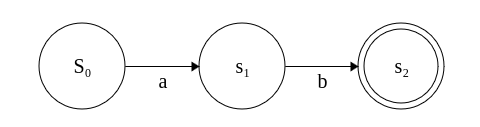
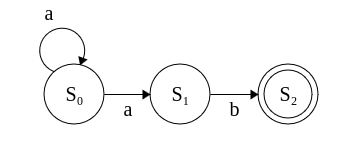
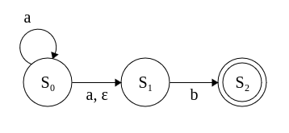

# Créer un langage de programmation - Développer un scanner 1.1
##### Édition TypeScript

- [Introduction à l'analyse lexicale](#introduction-à-lanalyse-lexicale)
- [Alphabets, Langages et Grammaires](#alphabets-langages-et-grammaires)
- [Langages réguliers](#langages-réguliers)
- [Automates finis](#automates-finis)


## Introduction à l'analyse lexicale
Comme nous l'avons vu dans le chapitre d'introduction, l'analyse lexicale est l'analyse et le découpage d'un code source en une suite de tokens. Le programme en charge de l'analyse lexicale est généralement appelé **scanner**, **lexer** ou **tokenizer**. 

### Les tokens
Chaque token est défini par un type et un lexème, qui est la représentation textuelle du token dans le code source :

| Type                                          | Lexèmes                                    |
|-----------------------------------------------|--------------------------------------------|
| Littéral                                      | `2`, `true`, `"hello"`                     |
| Mot-clé                                       | `if`, `while`, `class`                     |
| Opérateur                                     | `+`, `=`, `>=`, `&&`                       |
| Identifiant (nom de variable, fonction, etc)  | `x`, `printf`                              |

Ces lexèmes peuvent être décrits par des expressions régulières :

| Lexème    | Expression régulière  |
|-----------|-----------------------|
| if        | `\bif\b`               |
| while     | `\bwhile\b`            |
| class     | `\bclass\b`            |
| +         | `^\+`                  |
| =         | `^=`                   |
| &&        | `^&&`                  |


### Exemple d'analyse lexicale
Prenons l'instruction suivante :
```js
let x = 10;
```

Le scanner la découpe en plusieurs tokens :
- `let` (Mot-clé)
- `x` (Identifiant)
- `=` (Opérateur)
- `10` (Littéral - int)
- `;` (Symbole)

Si les lexèmes peuvent être décrits par des expressions régulières, alors nous pouvons utiliser un moteur de regex pour les identifier, et même les extraire du code source. Par exemple, JavaScript propose la classe `RegExp` :

```js
const stringRegex = new RegExp(`^"[^"]*"`);

console.log(stringRegex.test(`"hello world";`)); // true

console.log(stringRegex.test(`"123";`)); // true

console.log(stringRegex.test(`hello world;`)); // false
```

Ci-dessus, nous souhaitons détecter un token dont le premier caractère est `"`, en utilisant le symbole `^`. On matche un token à la fois, c'est pour ça que la présence du point-virgule en fin de chaîne n'est pas un problème.

> **Astuce JS** : vous pouvez définir une instance de RegExp de manière plus concise avec la syntaxe suivante :

> ```ts 
> const stringRegex = /^"[^"]*"/
> ```

Cependant, il est tout à fait possible d'atteindre le même objectif avec une fonction :

```ts
function acceptString(src: string) {
  if (src[0] !== `"`) return false;

  while (src.length > 0 && src[0] !== `"`) {
    src = src.slice(1);
  }

  return src[0] === `"`;
}

console.log(acceptString(`"hello world";`)); // true
console.log(acceptString(`"123";`)); // true
console.log(acceptString(`hello world";`)); // false
```

Les moteurs d'expressions régulières ne sont qu'un moyen de générer ce type de programme dynamiquement. Ces programmes peuvent être représentés sous forme de modèle mathématique appelé **automate fini**, nous allons y venir.

## Alphabets, Langages et Grammaires
Avant de débuter l'implémentation, il peut être bénéfique de comprendre quelques concepts clé de la théorie des langages.

### Langages naturels et langages formels
Commençons par bien distinguer langages naturels et langages formels.

Les **langages naturels** sont ceux que nous utilisons au quotidien, comme le français ou l’anglais. Ils sont marqués par des nuances, des contextes, sous-entendus et évoluent constamment.

Les **langages formels** suivent un ensemble de règles strictes : grammaire formelle. Ils excluent toute incertitude et toute ambiguïté.

Vous vous en doutez probablement, pour créer un langage de programmation, nous avons besoin d'une grammaire formelle. Donc, dans ce cours, lorsque nous évoquerons les termes « alphabet », « mot » et « grammaire », nous nous référons strictement aux langages formels.

### Alphabets et mots
Un alphabet est défini comme un ensemble **fini** et **non-vide** de symboles. Ces symboles peuvent être assemblés pour former des **mots** (ou **strings** en anglais). 

- **fini**, car ne peut pas contenir une infinité de symboles. <br />
- **non-vide**, car doit contenir au moins un symbole.

Par convention, un alphabet est souvent désigné par la lettre **Σ** (se prononce Sigma).

Exemple 1 : 
```
Σ = {1, 2, 3}
```
Mots qu'il est possible de créer : `1`, `12`, `123`, `321`, etc.

Exemple 2 : 
```
Σ = {+, -, =}
```
Mots qu'il est possible de créer : `+`, `-`, `=`, `+=`, `-=`, `==`, `===`, etc.

### Langages
Un **langage** est un ensemble de mots formés à partir d'un **alphabet**. Ces ensembles peuvent être soit finis, soit infinis.

#### Exemple de langage fini
```
Σ = { a, b }
L1 = { aa, bb }
```

Ici, **L1** contient uniquement les mots `aa` et `bb`.

#### Exemple de langage infini
Considérons le langage **L2** défini sur l'alphabet **Σ** dont les mots sont l'ensemble des combinaisons qu'il est possible de créer, encadré par le symbole `%`.

Si :
```
Σ = { %, a, b }
```

**L2** prend la forme suivante :

```
L2 = { %aa%, %ab%, %bb%, %aaabbbb%, ... }
```

Puisque **L2** est infini, il est plus clair de le représenter sous forme de notation d'ensemble : 

```
Σ' = Σ ∖ { % }
L2 = { %w% | w ∈ Σ' }
```

Pas de panique, je vais tout vous expliquer :wink:

Le symbole `\` est utilisé pour représenter la soustraction d'ensembles.

L'expression `Σ ∖ { % }` représente donc l'ensemble des caractères présents dans l'alphabet **Σ**, moins les éléments présents dans l'ensemble `{ % }`, ainsi :

```
Σ' = { a, b }
```

> Le symbole `'` (prime), présent dans `Σ'` permet généralement d'indiquer une variation, une dérivation ou une modification d'un élément existant.

Le symbole `|` signifie ***tel que*** et **∈** signifie ***appartenant à*** ou ***est un élément de***.

La notation :
```
Σ' = Σ ∖ { % }
L2 = { %w% | w ∈ Σ' }
```

Signifie donc que :

1) `w` est un mot délimité de part et d'autre par le caractère  `%`
2) `w` est composé uniquement de symboles appartenant à l'ensemble `{ a, b }`.

### Langages réguliers
**L2** est un langage formel dit régulier (ou rationnel). Un langage régulier est un langage qui est accepté par un **automate fini** (encore une fois, nous allons y venir).

[Stephen Cole Kleene](https://fr.wikipedia.org/wiki/Expression_r%C3%A9guli%C3%A8re) a inventé les expressions régulières pour représenter ce type de langage, voici **L2** sous forme d'expression régulière :
```
%[ab]+%
```

Sympa, non ? 
J'ai fait exprès de vous titiller un peu avec une notation d'ensemble, pour que vous commenciez à apprécier le concept d'expression régulière, souffrant souvent injustement d'une mauvaise image, alors qu'elles sont, utilisées dans le bon contexte, d'une aide précieuse.


Maintenant, souvenez-vous de l'expression régulière permettant de scanner un token de type **string** : 
```
"[^"]*"
```

On y observe la présence du symbole `*`, il s'agit de [l'étoile de Kleene](https://fr.wikipedia.org/wiki/%C3%89toile_de_Kleene), en référence au mathématicien dont on vient de parler. Elle indique ici qu'un caractère dans `[^"]` (tout caractère à l'exception de `"`) peut apparaître zéro ou plusieurs fois. Donc `""`, `"Hello, world!"` sont des chaînes acceptées par `"[^"]*"`.

Autre exemple, pour l'expression régulière `a*`, nous pouvons valider `ε`, `a`, `aa`, `aaa`, etc.

> `ε` (epsilon) est le symbole utilisé pour représenter le mot vide, c'est-à-dire ne contenant aucun symbole.

Si nous souhaitons que **L2** accepte le mot `%%`, alors il suffit d'ajuster notre expression régulière : `%[ab]*%`


## Automates finis
Un **automate fini**, également connu sous le nom de machine à états fini, est un modèle mathématique utilisé en sciences informatiques pour reconnaître et analyser des motifs ou des séquences au sein d'un texte ou d'une chaîne de symboles. Dans le contexte de l'analyse lexicale, ce modèle est pertinent, car il facilite l'identification des tokens (symboles, mots-clés, chaînes de caractères...).

### Structure d'un automate fini
* **États** : Ils représentent les positions ou situations possibles de l'automate.
* **Transitions** : Les mouvements que l'automate peut effectuer d'un état à un autre à partir d'un symbole.
* **État de départ** : L'état initial où l'automate débute son parcours.
* **États d'acceptation** : Atteindre ces états signifie que l'automate a reconnu le motif recherché.

### Automates Finis Déterministes
Un **automate fini déterministe** ou **DFA** (Deterministic Finite Automaton) en anglais, reconnaît des motifs simples et déterministes. Il a un nombre fini d'états, et pour chaque état, une symbole spécifique conduit à un état déterminé.

Prenons l'exemple d'un **DFA** pour le langage :
```
L₁ = { ab }
```

|  |
|:--:| 
| DFA_L1 |

* Il y a 3 états : **S₀**, **S₁**, **S₂**
* L'état initial est **S₀**
* L'état final est **S₂** (reconnaissable par sa bordure intérieure)
* Les transitions sont
  - De **S₀** à **S₁** via `a`
  - De **S₁** à **S₂** via `b`

Lorsque le DFA analyse le mot `ab`, il commence par **S₀**, transitionne vers **S₁** via `a`, puis transitionne vers **S₂**, état final, via `b`. Si le DFA atteint **S₂** après avoir traité toute la chaîne, cela signifie qu'il a reconnu le motif.

Le DFA ne peut avoir qu'une seule transition pour un symbole donnée depuis un état précis, d'où son aspect "déterministe". Si le DFA avait plusieurs transitions possibles pour un symbole depuis un état, il serait considéré comme un NFA (Automate Fini Non Déterministe).

### Automates Finis Non Déterministes
Un **automate fini non déterministe**, ou **NFA** (pour **Non-deterministic Finite Automaton**), contrairement aux DFA, peut avoir plusieurs transitions possibles pour un même symbole à partir d'un état donné. Cette caractéristique lui offre une flexibilité accrue, mais, souvent, augmente aussi sa complexité d'implémentation.

##### Caractéristiques d'un NFA
* **Plusieurs états possibles pour un symbole** : Un NFA peut transiter vers plusieurs états via un même un symbole depuis un état spécifique.
* **Transitions epsilon (ε)** : Les NFA peuvent avoir des transitions `ε`, qui ne nécessitent aucun symbole. Ces transitions permettent à l'automate de changer d'état sans préciser de symbole. On distingue parfois les NFA sans transitions `ε` (simplement appelés **NFA**) de ceux avec transitions `ε` (**NFA-ε**).

#### Exemples de NFA

##### 1. NFA reconnaissant L1 = { aⁿb | n ≥ 1 }.
Expression régulière : `a+b`

Représentation graphique :


* L'automate est composé de 3 états : **S₀**, **S₁**, et **S₂**.
* L'état initial est **S₀**.
* L'état final est **S₂**.
* Les transitions sont :
  * De **S₀** à **S₀** via `a`
  * De **S₀** à **S₁** via `a`
  * De S₁ à **S₂** via `b`

##### 2. NFA-ε reconnaissant L2 = { aⁿb | n ≥ 0 }.
Expression régulière : `a*b`

Représentation graphique :



* L'automate est composé de 3 états : **S₀**, **S₁**, et **S₂**.
* L'état initial est **S₀**.
* L'état final est **S₂**.
* Les transitions se décrivent ainsi :
  * De **S₀** à **S₀** via `a`
  * De **S₀** à **S₁** via `a`
  * De **S₀** à **S₁** via `ε`
  * De **S₁** à **S₂** via `b`

###### Traitement de l'entrée : `b`
* Départ de **S₀**
* Transition vers **S₁** via `ε`
* Transition vers **S₂** via `b`

En plus de l'entrée `b`, **L2** accepte toutes les mots de **L1**.

### Conversion de NFA en DFA
Du fait de leur nature non-déterministe, les NFA sont généralement plus complexes à implémenter que les DFA. Pour repérer un motif dans une séquence, un NFA va parcourir toutes les trajectoires possibles pour établir si la séquence est conforme au langage défini, ce qui peut entraîner des soucis de performance. 

## Conclusion
Il faut donc bien comprendre qu'un langage régulier est un langage formel pouvant être reconnu par un automate fini, et pouvant être décrit par une expression régulière.

Nous sommes très loin d'avoir abordé toutes les notions de la théorie des langages, nous en reparlerons un peu lorsque nous nous intéresserons à l'analyse syntaxique. Je pars du principe que beaucoup de lecteurs n'ont pas les bases mathématiques nécessaires ni d'intérêt pour le sujet, mais vous pouvez consulter les ressources présentes dans la section **Aller plus loin**.


## Aller plus loin
- Porter, Harry. (2015). Youtube. [Lecture 1/65: Background: What You Probably Know.](https://www.youtube.com/watch?v=TOsMcgIK95k) (Remise à niveau mathématique)
- Demaille, Akim. (21 novembre 2016). Youtube. [Théorie des Langages.](https://www.youtube.com/watch?v=WbUpN4fHs_k)
- Solnon, Christine. PDF. [Théorie des Langages.](https://perso.liris.cnrs.fr/christine.solnon/langages.pdf)
- Sipser, Michael. (2012). Introduction to the Theory of Computation.

## Crédits
- Les illustrations d'automate présentes dans ce cours ont été générées sur le site [https://madebyevan.com/fsm/](https://madebyevan.com/fsm/)
