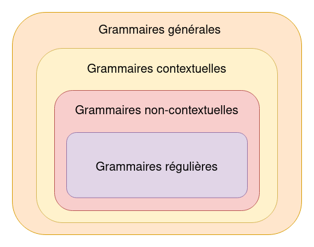

# Créer un langage de programmation - Développer un parser 1/3

##### Édition TypeScript

> Ce cours est toujours en cours de rédaction et peut contenir des erreurs.

# Sommaire
1. [Introduction à l'analyse syntaxique](#introduction-à-lanalyse-syntaxique)
2. [Automate à pile](#automate-à-pile)
3. [Grammaire formelle](#grammaire-formelle)
4. [Introduction à la notation EBNF](#introduction-à-la-notation-ebnf)
5. [Grammaire ambigüe](#grammaire-ambigüe)

## Introduction à l'analyse syntaxique
Comme nous l'avons vu dans [le chapitre d'introduction](https://github.com/jean-michelet/create-programming-language-ts/blob/main/fr/0/introduction.md#analyse-syntaxique), l'analyse syntaxique (parsing) permet de s'assurer qu'un programme respecte la grammaire du langage.

Par exemple, ce programme JavaScript est lexicalement valide : `let if = while }`.

Cependant, la grammaire du langage n'est pas respectée :
- `let` doit être suivi d'un identifiant, `if` est un mot-clé.
- `while` est un mot-clé et ne peut donc être assigné à une variable.
- Le token `}` indique une fermeture de block et doit donc avoir une ouverture correspondante `{`.

Une version valide du programme pourrait être :

```js
{
  let iff = whilee
}
```

Même si la variable `whilee` n'est pas déclarée, le code est syntaxiquement valide. Vous pouvez générer un AST sur le site [astexplorer.net](https://astexplorer.net/) afin de vérifier :

```json
{
  "type": "Program",
  "start": 0,
  "end": 23,
  "body": [
    {
      "type": "BlockStatement",
      "start": 0,
      "end": 23,
      "body": [
        {
          "type": "VariableDeclaration",
          "start": 5,
          "end": 21,
          "declarations": [
            {
              "type": "VariableDeclarator",
              "start": 9,
              "end": 21,
              "id": {
                "type": "Identifier",
                "start": 9,
                "end": 12,
                "name": "iff"
              },
              "init": {
                "type": "Identifier",
                "start": 15,
                "end": 21,
                "name": "whilee"
              }
            }
          ],
          "kind": "let"
        }
      ]
    }
  ],
  "sourceType": "module"
}
```

## Automate à pile

Dans le module consacré à l'analyse lexicale, nous avons introduit la notion de langage formel. Nous nous sommes particulièrement intéressé aux langages réguliers, les expressions régulières et les automates finis qui sont trois concepts étroitement liés :

- un automate fini est un modèle mathématique permettant de reconnaître un langage régulier.
- un langage régulier peut-être décrit par une expression régulière.
- un automate peut être décrit par une expression régulière et inversement.

Le problème est que ces notions ne permettent pas d'analyser certaines structures, comme l'équilibrage des parenthèses `(()())` ou des accolades `{{}{}}`, qui nécessite de compter le nombre d'ouvertures et de fermetures. Ceci est dû au fait qu'un automate fini a, par définition, un nombre fini d'états et ne peut donc pas stocker un nombre arbitraire d'informations.

Pour résoudre cette problématique, nous avons recours à des concepts plus avancés tels que les [**automates à pile**](https://en.wikipedia.org/wiki/Pushdown_automaton) ou **pushdown automata** (*automaton* au singulier) en anglais, ainsi que les grammaires non-contextuelles. L'automate à pile se distingue par sa capacité à stocker une quantité indéterminée d'informations grâce à sa pile, ce qui lui permet, par exemple, de suivre le nombre de parenthèses ouvertes et de garantir leur équilibrage.

Exemple d'automate à pile (stack) permettant de reconnaître des parenthèses équilibrées :

```ts
function acceptBalancedParentheses(input: string): boolean {
  const stack: string[] = []

  for (const char of input) {
    if (char === '(') {
      stack.push(char)
    } else if (char === ')') {
      // La pile doit contenir au moins une parenthèse ouvrante
      if (stack.length === 0) {
        return false
      }

      stack.pop()
    }
  }

  // Si la pile est vide, les parenthèses sont équilibrées
  return stack.length === 0
}

// Tests
console.log(acceptBalancedParentheses('(()())')) // true
console.log(acceptBalancedParentheses('(()')) // false
console.log(acceptBalancedParentheses('(())))')) // false
console.log(acceptBalancedParentheses(')(')) // false
```

Jusqu'à présent, nous n'avons quasiment pas parlé de grammaire, car les expressions régulières et automates finis offrent une compréhension suffisamment claire des langages réguliers. Mais cela devient insuffisant lorsque l'on souhaite analyser des structures plus complexes comme celles évoquées ci-dessus.

## Grammaire formelle

Une grammaire formelle est définie par un quadruplé (_4-tuple_ en anglais) comprenant un ensemble de symboles non-terminaux, un ensemble de symboles terminaux, un ensemble de règles de production, et un symbole de départ : (**N**, **Σ**, **P**, **S**) :
- **N** est l'ensemble des symboles non terminaux.
- **Σ** est l'ensemble des symboles terminaux.
- **P** est l'ensemble des règles de production.
- **S** est le symbole de départ.

### Exemple de grammaire

Considérons une grammaire **G** pour le langage **L = { aⁿb | n ≥ 0 }** :

#### 1. Ensemble de symboles non-terminaux **N** : { **S**, **A** }.

Les symboles non-terminaux peuvent être considérés comme des variables pouvant être substituées par une ou plusieurs règles de productions.

#### 2. Ensemble de symboles terminaux **Σ** : { `a`, `b` }

Les symboles terminaux sont les unités indivisibles d'une grammaire.

#### 3. Règles de production **P** :
- **S** → **A**b (une production de **A** suivie d'un `b`)
- **A** → a**A** (un terminal `a` suivi d'une production de **A**)
- **A** → ε (une séquence vide, indique une absence de caractère.)

#### 4. Symbole de départ **S**
Le symbole de départ est le symbole non-terminal par lequel on commence l'analyse.

### Exemples

#### Analyse de l'entrée `b`

- Nous partons de _**S** → **A**b_.
- Nous substituons **A** par _ε_, conformément à la règle _**A** → ε_.
- Nous obtenons _**S** → b_.

Conclusion : `b` est une entrée valide pour **G**.

#### Analyse de l'entrée `aab`

- Nous partons de _**S** → **A**b_.
- Nous substituons **A** par a**A**, conformément à la règle _**A** → a**A**_.
- Nous obtenons _**S** → a**A**b_.
- Nous répétons la même substitution pour **A**
- Nous obtenons _**S** → aa**A**b_.
- Nous substituons **A** par *ε*, conformément à la règle _**A** → ε_.
- Nous obtenons _**S** → aab_.

Conclusion : `aab` est une entrée valide pour **G**.

#### Analyse de l'entrée `bb`

Pour analyser `bb` :

- Nous partons de _**S** → **A**b_.
- Aucune substitution de **A** ne produit `bb` :
  - Substituer **A** via la règle _**A** → a**A**_ donnerait a**A**b, pas `bb`.
  - Substituer **A** via la règle _**A** → ε_ donnerait `b`, pas `bb`.

Conclusion : `bb` n'est pas une entrée valide pour **G**.

### Hiérarchie de Chomsky

La hiérarchie de Chomsky, établie par le linguiste et philosophe [Noam Chomsky](https://en.wikipedia.org/wiki/Noam_Chomsky), classe les grammaires formelles en quatre niveaux de complexité. Chaque niveau supérieur dans cette hiérarchie possède les capacités de tous les niveaux inférieurs. Ainsi, les langages reconnus par une grammaire non-contextuelle (Type 2) sont également reconnus par les grammaires contextuelles (Type 1), mais pas nécessairement l'inverse.

|  |
| :----------------------------: |
|     Hiérarchie de Chomsky      |

#### Type 0 - Grammaires générales (sans restrictions)
Ces grammaires génèrent les langages récursivement énumérables. Il n'y a aucune restriction sur les règles de production. Elles sont suffisamment puissantes pour décrire n'importe quel langage pouvant être reconnu par une [machine de Turing](https://fr.wikipedia.org/wiki/Machine_de_Turing).

#### Type 1 - Grammaires contextuelles
Ces grammaires génèrent les langages sensibles au contexte. Les règles de production peuvent être appliquées en tenant compte du contexte des symboles. Elles sont plus restrictives que les grammaires de type 0.

#### Type 2 - Grammaires non-contextuelles
Ces grammaires génèrent les langages algébriques. Les règles de production sont de la forme **A** → **γ**, où **A** est un symbole non-terminal et **γ** est une chaîne de symboles terminaux et/ou non-terminaux. Elles sont utilisées pour décrire la syntaxe de la plupart des langages de programmation.

**Exemple :** le langage des parenthèses équilibrées **L = { (ⁿ )ⁿ | n ≥ 0 }** est décrit par une grammaire non-contextuelle.

#### Type 3 - Grammaires Régulières
Ces grammaires génèrent les langages réguliers. Les règles de production sont soit de la forme **A** → _a**B**_, soit de la forme _**A** → **B**a_, mais pas simultanément, où **A** et **B** sont des symboles non-terminaux et *a* est un symbole terminal. Ces grammaires correspondent aux expressions régulières et aux automates finis.

**Exemple :** le langage **L = { aⁿb | n ≥ 0 }** est décrit par la grammaire **G** [étudiée plus haut](#exemple-de-grammaire).

### Exemple de grammaire non-contextuelle
Pour illustrer une grammaire non-contextuelle, considérons une série d'additions avec et sans parenthèses.

Le quadruplé pour cette grammaire serait :
- **N** : { **E** } (signifiant expression)
- **Σ** : { `number`, `+`, `(`, `)` }
  - `number` représente n'importe quel nombre entier.
- **P** :
  - **E** → **E** + **E**
  - **E** → ( **E** )
  - **E** → number
- **S** : **E**

Nommons cette grammaire **GE**.

#### Analyse de l'entrée `7`
- Nous partons de _**E** → number_.
- Nous substituons **E** par _number_, conformément à la règle _**E** → number_.
- Nous obtenons _number_.

Conclusion : `7` est une entrée valide pour **GE**.

#### Analyse de l'entrée `3 + 5`
- Nous partons de _**E** → **E** + **E**_.
- Nous substituons les deux **E** par _number_, conformément à la règle _**E** → number_.
- Nous obtenons _number + number_.

Conclusion : `3 + 5` est une entrée valide pour **GE**.

#### Analyse de l'entrée `(3 + 5) + 2`
- Nous partons de _**E** → **E** + **E**_.
- Nous substituons le premier **E** par _( **E** )_, conformément à la règle _**E** → ( **E** )_.
- Nous substituons le deuxième **E** par _number_, conformément à la règle _**E** → number_.
- Nous obtenons _( **E** ) + number_.
- Nous substituons **E** par _**E** + **E**_, conformément à la règle _**E** → **E** + **E**_.
- Nous obtenons _( **E** + **E** ) + number_.
- Nous substituons les deux **E** par _number_, conformément à la règle _**E** → number_.
- Nous obtenons _( (number + number) + number )_.

Conclusion : `(3 + 5) + 2` est une entrée valide pour **GE**.

## Introduction à la notation EBNF

La notation Extended Backus-Naur Form ([EBNF](https://en.wikipedia.org/wiki/Extended_Backus%E2%80%93Naur_form)) est un outil puissant pour définir la syntaxe des langages. Développée comme une extension de la notation Backus-Naur Form ([BNF](https://en.wikipedia.org/wiki/Backus%E2%80%93Naur_form)), l'EBNF apporte une plus grande flexibilité dans la représentation des grammaires formelles.

### Exemple de grammaire EBNF
Considérons une grammaire, nommée **GE2**, pour une série d'additions avec et sans parenthèses, où `number` représente tout nombre entier. 

Une représentation EBNF possible est :
```ebnf
expression ::= expression '+' expression
             | '(' expression ')'
             | number
```

> Le symbole `|` signifie *union* et peut être traduit par *ou*. 

Dans cet exemple, `number` est un symbole terminal qui représente n'importe quel nombre entier.

#### Analyse de l'entrée `(3 + 5) + 2`

- Nous débutons avec l'expression ***expression** + **expression***.
- Nous substituons la première **expression** par *( **expression** )* et la seconde par *number*.
- Nous obtenons *( **expression** ) + number*.
- Nous substituons **expression** par **expression** + **expression**.
- Nous obtenons *( **expression** + **expression** ) + number*.
- Nous substituons chaque **expression** par *number*.
- Nous obtenons *( number + number ) + number*.

Conclusion : `(3 + 5) + 2` est donc une entrée valide pour **GE2**.

## Grammaire ambiguë
Une grammaire est considérée ambiguë lorsqu'une même chaîne de caractères peut être représentée par plus d'un arbre de dérivation distinct, menant à différentes structures syntaxiques.

#### Exemple d'Ambiguïté
Considérons la grammaire simple suivante pour les expressions arithmétiques :
```ebnf
expression ::= expression '+' expression
             | expression '*' expression
             | number;
```

La chaîne `3 + 4 * 5` peut être représentée de deux façons différentes :
`(3 + 4) * 5` ou `3 + (4 * 5)`

Ces deux interprétations ont des significations différentes, l'une ajoutant 3 et 4 avant de multiplier par 5, l'autre multipliant 4 et 5 avant d'ajouter 3. Nous y reviendrons plus en détails lors de l'implémentation du parser de EduScript, mais voici un exemple de grammaire qui résout le problème :
```ebnf
expression ::= term { ('+' | '-') term }
term       ::= factor { ('*' | '/') factor }
factor     ::= 'number' | '(' expression ')'
```

L'utilisation des accolades `{}` avec les opérateurs `+` et `*` indique que ces opérations peuvent être appliquées zéro ou plusieurs fois.

## Aller plus loin
Les ressources disponibles dans le chapitre [Développer un scanner 1/2](https://github.com/jean-michelet/create-programming-language-ts/blob/main/fr/1/lexical-analysis-theory.md#aller-plus-loin) sont valables pour les notions théoriques introduites dans ce chapitre.
